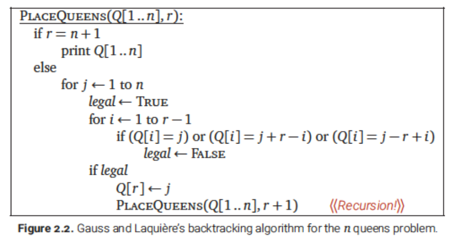

# Backtracking

Recursion을 사용하는 또 다른 문제해결 기법   
[N Queens 문제](#n-queens-problem)   
[Subset Sum 문제](#subset-sum)   
[Backtracking : General Pattern](#backtracking-general-pattern)   
[Longest Increasing Subsequence(LIS) 문제](#longest-increasing-subsequencelis)   

## 백트래킹 알고리듬
- 올바른 또는 최선의 **결정**으로 점진적으로 문제를 해결해나간다.
- 알고리듬이 문제를 풀기위해 여러가지의 선택지 중에 하나를 골라야할때 모든 선택지를 **재귀적인 방식**으로 계산해보고 최상의 것을 선택한다.

## N Queens Problem
>가장 대중적인 백트래킹 알고리듬의 예

 > N x N 체스보드 위에 서로 공격받지 않도록 n개의 Queen을 배치할 수 있을까?
 가능하다면 그런 배치는 총 몇가지가 있을까?
 


#### 가우스의 recursive 전략

* Queen을 위에서부터 각 row에 하나씩 배치한다.
* r번째 queen을 r번째 row에 배치할 때, n개의 칸을 모두 시도해본다.
    * 만약 어떤 칸이 이전에 배치한 Queen에 의해 공격 받으면 그 칸은 무시한다.
    * 그렇지 않으면 거기에 일단 **임시로**배치하고 그 다음 Queen들을 다음 row에 배치하는 것을 recursion을 사용하여 지속한다.


## Subset Sum
>백트래킹 알고리듬의 두번째 예

> 유한 개의 정수로 이루어진 집합 X와 정수 T가 있을 때 이 집합의 부분집합 중에서 그 집합의 원소를 다 더한 값이 T이 되는 경우가 있는지를 알아내는 문제
```
X={8,6,7,5,3,10,9}  and T=15
{8,7},{5,10},{6,9},{7,5,3} = true

X={11,6,5,1,7,13,12}  and T=15 
No subset sums to 15 -> false
```


- Some trivial cases (base cases)
  - 만약 T = 0, 이라면 항상 **true**
  - 만약 T < 0 또는 X가 비었고 T>0이면 항상 **거짓**
- General case
  - X의 원소 a가 있을 때, 총합이 T인 X의 부분집합이 존재한다면 a를 포함하거나 a를 포함하지 않는다. 
  - 만약 a가 포함된다면
    - 총합이 T-a인 X-{a}의 부분집합이 존재
  - 만약 a가 포함되지 않는다면
    - 총합이 T인 X-{a}의 부분집합이 존재
- 따라서 SunsetSum(X,T)를 풀기 위해
  - SubsetSum(X-{a},T-a)와 SubsetSum(X-{a},T)로 reduce 가능
  - 둘 다 smaller instance of SubsetSum(X,T) -> Recursion 가능!
<br>

##### A more implementable backtraking algorithm

- 임의의 원소 a를 구하기 위하여 인덱스 i를 함께 넘겨줌   
> 시간 복잡도   
> - A(n)을 Subset Sum의 시간복잡도라고 정의하면   
> A(n)의 Recurrence는 $A(n) \leq 2A(n-1) + O(1) $   
> 따라서 $A(n) = O(n^2)$   

<br>

### Backtracking : General Pattern
백트래킹 알고리듬은 대부분 sequence of decision을 만들어낸다.   
여기에는 특정 조건(constraint)를 만족하는 recursive한 구조를 만드는게 목적이고 이것 자체가 대부분의 경우 (often) sequence의 형태를 가진다.

- **N-queens 문제**
  - 목적: sequence of queen positions을 찾는게 목적
  - 조건: queens은 각 row 당 하나씩, 서로 공격할 수 없게함
  - 위의 알고리즘은 각 row에서 queens을 어디 놓을지 결정(decide)
- **Subset Sum 문제**
  - 목적: sequence of input 원소(X에 속한)를 찾는 게 목적
  - 조건: 그 sequence에 속한 원소의 총합이 T와 같아야함
  - 위의 알고리즘은 각 원소를 포함할지 말지를 결정(decide)

각각의 재귀호출에서는 **하나의 결정을 해야한다**   
그리고 이러한 결정은 반드시 모든 이전 결정과 일관성이 있어야한다.
따라서 각각의 재귀호출에서는 입력 데이터의 위치 뿐만 아니라 이전에 했던 결정에 대한 알맞은 summary도 제공해야한다.

- **N-queens 문제에서 재귀호출시 넘겨주는 정보**
  - 비어있는 row들의 정보
  - 전에 배치한 Queen들의 정보
- **Subset Sum 문제에서 재귀호출시 넘겨주는 정보**
  - (포함여부를) 고려하지 않은 나머지 원소
  - 남은 target의 값(기존 T에서 선택된 원소의 값을 뺀 나머지 값)

## Longest Increasing Subsequence(LIS)

- LIS 문제
  - 입력: sequence A[1..n] if n integers
  - 출력: length of longest increasing subsequence of A
- Increasing subsequence of A
  - 오름차순으로 정렬된 원소의 부분열(Subsequence)
- LIS of A
  - A의 증가하는 부분열의 최대 길이
<br>

- **Backtracking 기법을 적용하기 1**
  - 어떤 결정(decide)의 연속(sequence)을 통해 LIS를 만들어 내기
  - 임의의 subsequence는 주어진 sequence A의 각 원소를 포함하느냐 포함하지 않느냐로 결정됨
- **Backtracking 기법을 적용하기 2**
  - 즉, j번째 원소 A[j]를 포함시킬까 말까를 결정하기 위해
    - 임시로 A[j]를 **포함시킨 후**, 나머지 결정을 recursion
    - 임시로 A[j]를 **제외시킨 후**, 나머지 결정을 recursion
  - 한 후에 더 긴 subsequence가 나오는 것으로 결정한다
  - 또한 A[j]가 이전에 선택한 원소들보다 커야한다는 조건을 확인해야함
- **Backtracking 기법을 적용하기 3**
  - 이런 방법이 동작하려면 지난 결정들에 대한 어떤 정보를 기억해야 하는가?
  - A[1..j-1]에서 포함시킨 원소는 increasin subsequence기 때문에 A[j]는 그것들 보다 커야 포함 가능
  - 따라서 포함된 원소중 **마지막 원소를 기억**해야함!
  <br>

- 일반화된 LIS 문제
  - 입력: A[1..n] 과 integer prev
  - 출력: length of LIS of A in which every element is larger than prev

- 일반화된 LIS 문제 (고정된 A)
  - 입력: 두개의 인덱스 i와 j
  - 출력: length of LIS of A[j..n] in which every element is larger than A[i]

